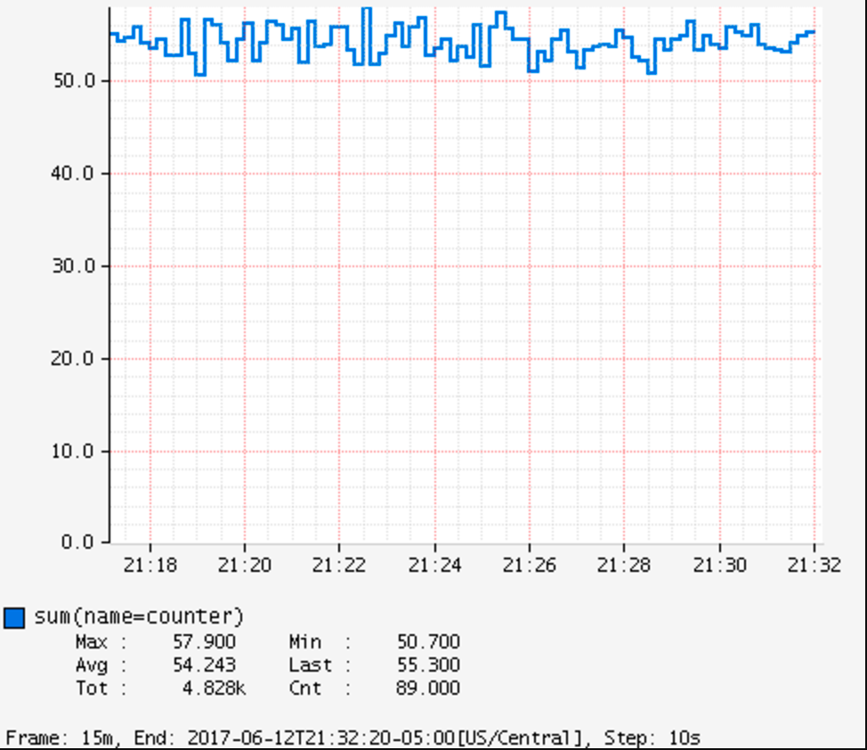

Counters report a single metric, a count. The `Counter` interface allows you to increment by a fixed amount, which may be negative.

When building graphs and alerts off of counters, generally you should be most interested in measuring the rate at which some event is occurring over a given time interval. Consider a simple queue. Counters could be used to measure
things like the rate at which items are being inserted and removed.

It's tempting at first to conceive of visualizing absolute counts rather than a rate, but the absolute count is usually both a function of the rapidity with which something is used *and* the longevity of the application instance under instrumentation. Building dashboards and alerts of the rate of a counter per some interval of time disregards the longevity of the app, letting you see aberrant behaivor long after the app has started.

Be sure to read through the timer section before jumping in to using counters,
as timers record a count of the timed events as a separate metric. For those
pieces of code you intend to time, you do NOT need to add a counter separately.

The following code simulates a real counter whose rate exhibits some
perturbation over a short time window.

[source,java]
----
RandomEngine r = new MersenneTwister64(0);
Normal dist = new Normal(0, 1, r);

MeterRegistry registry = ...
Counter counter = registry.counter("counter");

Flux.interval(Duration.ofMillis(10))
        .doOnEach(d -> {
            if (dist.nextDouble() + 0.1 > 0) { <1>
                counter.increment();
            }
        })
        .blockLast();
----
<1> A slightly positively-biased random walk.

ifeval::["{system}" == "atlas"]
Atlas serves up graphs in the form of PNG images (and in other output formats as well).

We use the following query to visualize the counter from Atlas with an explanation of some of the query parameters we are setting to control the rendering of the graph. Note that the value is rate-normalized over the step interval rather than monotonically increasing.

.Counter over a positive-biased random walk.

[source,http]
----
GET /api/v1/graph?
       q=
       name,counter,:eq,
       2,:lw
       &tz=US/Central
       &s=e-15m <1>
       &w=400 <2>
       &l=0 <3>
Host: localhost:7101
----
<1> The range of time we want to visualize along the x-axis. `e` represents the end time or "now". This graph's axis will be from 15 minutes ago until now. Atlas automatically chooses the finest grained step interval available from the data that would render at least 1px wide on the resultant image.
<2> The overall width of the PNG image returned should be 400px.
<3> Set the y-axis lower limit to be 0 so random perturbation in the walk doesn't look so dramatic.
endif::[]

ifeval::["{system}" == "datadog"]
Datadog rate-normalizes counters over a time window. The query that generates a graph for the random-walk counter is `counter`.

.A datadog rendered graph of the random walk counter.
image::img/datadog-counter.png[Datadog-rendered counter]

endif::[]

ifeval::["{system}" == "prometheus"]
The query that generates a graph for the random-walk counter is
`rate(counter[10s])`.

.A grafana rendered graph of the random walk counter.
image::img/prometheus-counter.png[Grafana-rendered Prometheus counter]

Representing a counter without rate normalization over some time window is rarely useful, as the representation is a function of both the rapidity with which the counter is incremented and the longevity of the service. The following image shows how the counter drops back to zero on service restart. The rate-normalized graph above would return back to a value around 55 as soon as the new instance (say on a production deployment) was in service.

.Counter over the same random walk, no rate normalization.
image::img/prometheus-counter-norate.png[Grafana-rendered Prometheus counter (no rate)]

endif::[]
