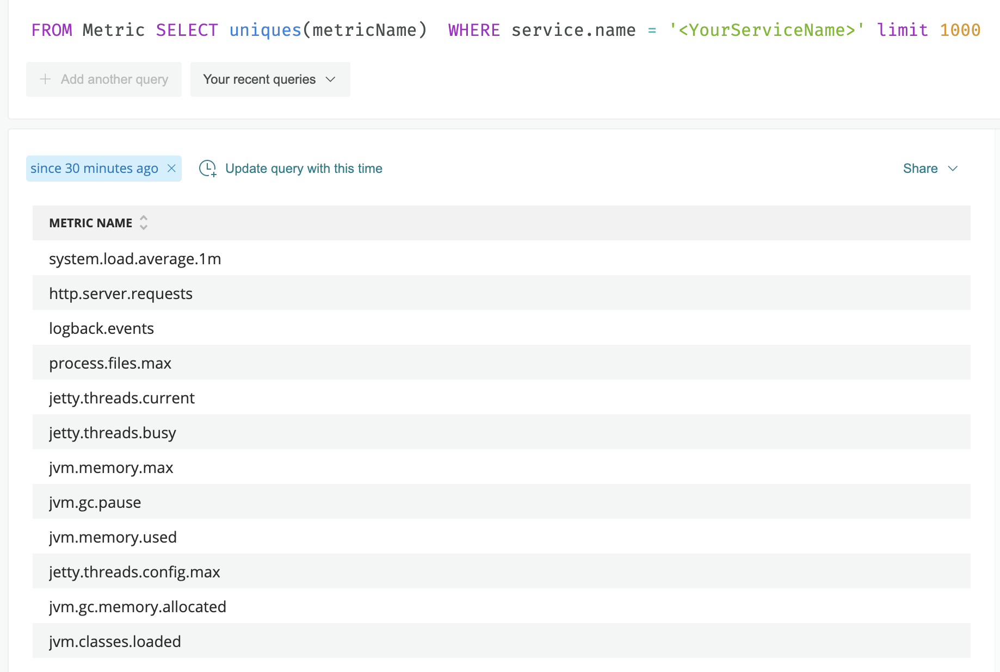
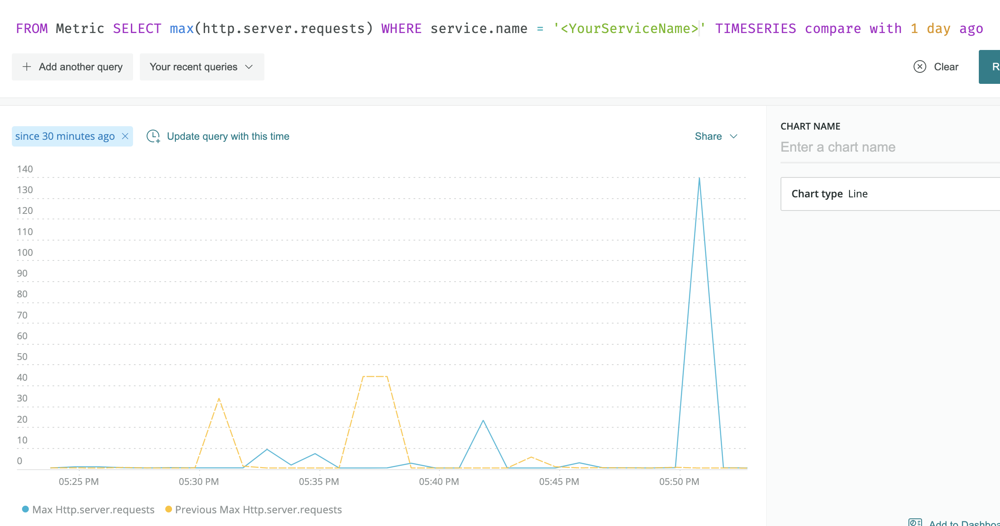

= Micrometer New Relic
New Relic Open Source <opensource@newrelic.com.>
:toc:
:sectnums:
:system: new-relic

New Relic is a powerful observability platform with Micrometer
https://github.com/newrelic/micrometer-registry-newrelic[support through its NewRelicRegistry implementation].
Micrometer metrics are converted into New Relic dimensional metrics, which can be
displayed in dashboards and used to create alerts.  The New Relic platform supports
full programmability in addition to custom queries with the NRQL language.

NOTE: Please use the New Relic provided `NewRelicRegistry` instead of Micrometer's `NewRelicMeterRegistry`. The instructions here
are for the current https://github.com/newrelic/micrometer-registry-newrelic[New Relic registry].

== Installing

You can first find the latest version published https://mvnrepository.com/artifact/com.newrelic.telemetry/micrometer-registry-new-relic[to Maven Central].
Next, set your project to depend on the New Relic Micrometer registry (inserting the version number as appropriate):

=== Gradle

Add the following dependency to your `build.gradle.kts`

[source,kotlin]
----
implementation("com.newrelic.telemetry:micrometer-registry-new-relic:${newrelic-registry.version}")
----

=== Maven

Add the following dependency to your `pom.xml`:

[source,xml,subs=+attributes]
----
<dependency>
  <groupId>com.newrelic.telemetry</groupId>
  <artifactId>micrometer-registry-new-relic</artifactId>
  <version>${newrelic-registry.version}</version>
</dependency>
----

== Configuring

In order to send data to New Relic, you will need an https://docs.newrelic.com/docs/apis/get-started/intro-apis/types-new-relic-api-keys#event-insert-key[insert api key].  Once you have obtained an insert api key, you can put it into your environment (like the example below) or otherwise
get it into your application's configuration.

[source,java]
----

NewRelicRegistryConfig config = new NewRelicRegistryConfig() {
    @Override
    public String get(String key) {
      return null; // accept the rest of the defaults
    }

    @Override
    public String apiKey() {
      return System.getenv("INSERT_API_KEY");
    }

    @Override
    public Duration step() {
      return Duration.ofSeconds(5);
    }

    @Override
    public String serviceName() {
      return "My Service Name";
    }
};

MeterRegistry newRelicRegistry =
        NewRelicRegistry.builder(config)
            .commonAttributes(
                new Attributes()
                    .put("host", InetAddress.getLocalHost().getHostName()))
            .build();
newRelicRegistry.start(new NamedThreadFactory("newrelic.micrometer.registry"));
----

`NewRelicConfig` is an interface with a set of default methods. If, in the implementation of `get(String k)`, rather than returning `null`, you  instead bind it to a property source, you can override the default configuration. For example, Micrometer's Spring Boot support binds properties prefixed with `management.metrics.export.newrelic` directly to the `NewRelicConfig`:

[source,yml]
----
management.metrics.export.newrelic:
    api-key: MY_INSIGHTS_API_KEY

    # The interval at which metrics are sent to New Relic. See Duration.parse for the expected format.
    # The default is 5 seconds.
    step: 10s
----

== Observing Metrics

The quickest way to start using your data is to
navigate to https://one.newrelic.com[New Relic One] and use the entity explorer to find
your service by its name.

image::img/new-relic-entity-explorer.png[NR1 entity explorer]

After choosing the service from the search results, you should
be met with some familiar metrics:

image::img/new-relic-metrics1.png[NR1 default metrics]

Please note that other graphs exist but are not shown for brevity (such as
"Heap memory" and "CPU utilization").

You can use this simple interface to easily filter or group your metrics by
many common facets, such as hostname or status.  If you wish to see the
NRQL query that generated a given graph, choose "View query" from the
graph's overflow menu.

== Querying Metric Data

Micrometer metric data is also available for querying with NRQL.

Please see the https://docs.newrelic.com/docs/data-ingest-apis/get-data-new-relic/metric-api/query-metric-data-type[official documentation]
for detailed information about querying your metric data.

To see what metric names are available, try starting with a query like
[source,nrql]]
----
FROM Metric SELECT uniques(metricName) WHERE service.name = '<YourServiceName>' limit 1000
----

Once you have identified a metric of interest, you can leverage NRQL to perform interesting queries:

https://docs.newrelic.com/docs/data-ingest-apis/get-data-new-relic/metric-api/query-metric-data-type[See the official documentation] for many
more useful examples.

== Types

New Relic maintains a document that describes https://github.com/newrelic/newrelic-exporter-specs/tree/master/micrometer[how Micrometer metric types are mapped 
into the New Relic metric types].  Please feel free to open an issue if you have questions.

Changes and feedback are welcome and appreciated.

