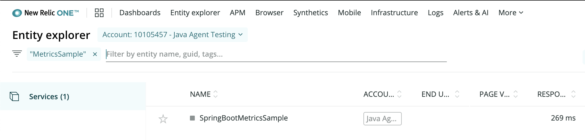
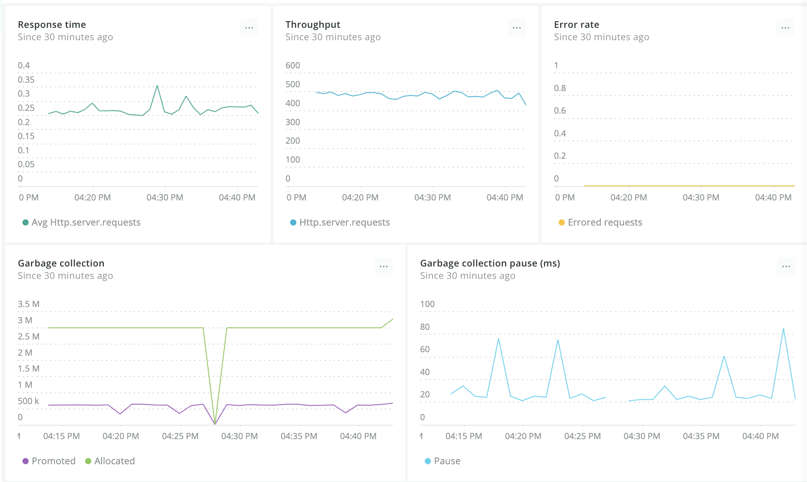
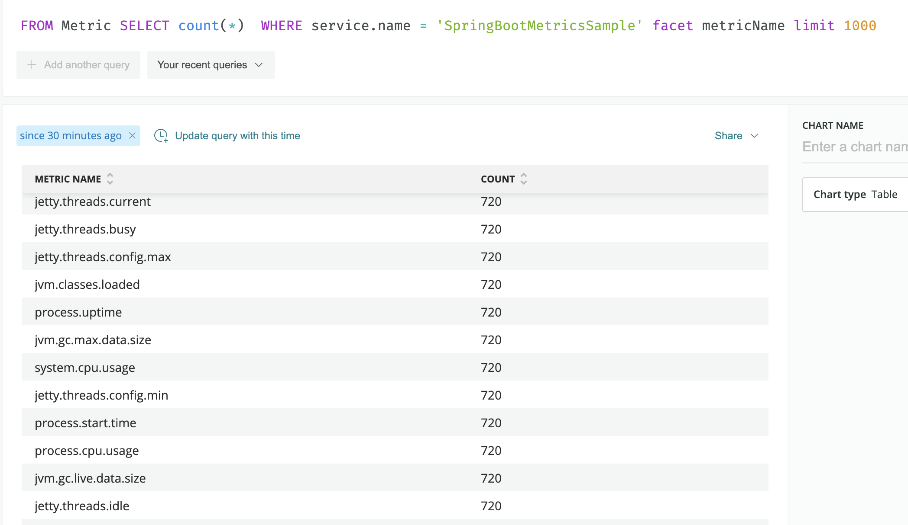

= Micrometer New Relic
New Relic Open Source <open-source@newrelic.com.>
:toc:
:sectnums:
:system: new-relic

New Relic is a powerful observability platform with Micrometer
https://github.com/newrelic/micrometer-registry-newrelic[support through its NewRelicRegistry implementation].
Micrometer metrics are converted into New Relic dimensional metrics, which can be
displayed in dashboards and used to create alerts.  The New Relic platform supports
full programmability in addition to custom queries with the NRQL language.

NOTE: Please use the New Relic provided `NewRelicRegistry` instead of Micrometer's `NewRelicMeterRegistry`. The instructions here
are for the current https://github.com/newrelic/micrometer-registry-newrelic[New Relic registry].

== Installing

You can first find the latest version published https://mvnrepository.com/artifact/com.newrelic.telemetry/micrometer-registry-new-relic[to Maven Central].
Next, set your project to depend on the New Relic Micrometer registry (inserting the version number as appropriate):

=== Gradle

Add the following dependency to your `build.gradle.kts`

[source,kotlin]
----
implementation("com.newrelic.telemetry:micrometer-registry-new-relic:${newrelic-registry.version}")
----

=== Maven

Add the following dependency to your `pom.xml`:

[source,xml,subs=+attributes]
----
<dependency>
  <groupId>com.newrelic.telemetry</groupId>
  <artifactId>micrometer-registry-new-relic</artifactId>
  <version>${newrelic-registry.version}</version>
</dependency>
----

== Configuring

In order ot send data to New Relic, you will need an https://docs.newrelic.com/docs/apis/get-started/intro-apis/types-new-relic-api-keys#event-insert-key[insert api key].  Once you have obtained an insert api key, you can put it into your environment (like the example below) or otherwise
get it into your application's configuration.

[source,java]
----

NewRelicRegistryConfig newRelicConfig() = new NewRelicRegistryConfig() {
    @Override
    public String get(String key) {
      return null; // accept the rest of the defaults
    }

    @Override
    public String apiKey() {
      return System.getenv("INSERT_API_KEY");
    }

    @Override
    public Duration step() {
      return Duration.ofSeconds(5);
    }

    @Override
    public String serviceName() {
      return "My Service Name";
    }
};

MeterRegistry newRelicRegistry =
        NewRelicRegistry.builder(config)
            .commonAttributes(
                new Attributes()
                    .put("host", InetAddress.getLocalHost().getHostName()))
            .build();
newRelicRegistry.start(new NamedThreadFactory("newrelic.micrometer.registry"));
----

`NewRelicConfig` is an interface with a set of default methods. If, in the implementation of `get(String k)`, rather than returning `null`, you  instead bind it to a property source, you can override the default configuration. For example, Micrometer's Spring Boot support binds properties prefixed with `management.metrics.export.newrelic` directly to the `NewRelicConfig`:

[source,yml]
----
management.metrics.export.newrelic:
    api-key: MY_INSIGHTS_API_KEY

    # The interval at which metrics are sent to New Relic. See Duration.parse for the expected format.
    # The default is 5 seconds.
    step: 10s
----

== Observing Metrics

The quickest way to start using your data is to
navigate to https://one.newrelic.com[New Relic NR1] and use the entity explorer to find
your service by its name.

After choosing the service from the search results, you should
be met with some familiar metrics:

Please note that other graphs exist but are not shown for brevity (such as
"Heap memory" and "CPU utilization").

You can use this simple interface to easily filter or group your metrics by
many common facets, such as hostname or status.  If you wish to see the
NRQL query that generated a given graph, choose "View query" from the
graph's overflow menu.

== Querying Metric Data

Micrometer metric data is also available for querying with NRQL.

Please see the https://docs.newrelic.com/docs/data-ingest-apis/get-data-new-relic/metric-api/query-metric-data-type[official documentation]
for detailed information about querying your metric data.

To see what metric names are available, try starting with a query like
[source,nrql]]
----
FROM Metric SELECT count(*) WHERE service.name = '<YourServiceName>' facet metricName limit 1000
----

=== Timers

At each publishing interval, the New Relic `Timer` produces a single event with the timer's name and several attributes:

1. `avg` - A mean latency for the publishing interval.
2. `count` - Throughput per second over the publishing interval.
3. `totalTime` - Total time per second over the publishing interval (used with `count`) to create aggregable means.

Additionally, if any percentiles or SLA buckets are defined on the timer, additional events are produced:

4. `${name}.percentiles` - Micrometer calculated percentiles for the publishing interval. One event is produced for each percentile, with a tag of `phi` in the range [0,1].
5. `${name}.histogram` - One event is produced for each SLA boundary with a tag of 'le', indicating that it represents a cumulative count of events less than or equal to SLA boundaries over the publishing interval.

To generate an aggregable view of latency in New Relic, divide `totalTime` by `count`:

[source,sql]
----
SELECT sum(totalTime)/sum(count) as 'Average Latency', max(max) as 'Max' FROM timer since 30 minutes ago TIMESERIES auto
----

.Timer latency.
image::img/new-relic-timer-latency.png[New Relic-rendered timer]

To generate a throughput chart:

[source,sql]
----
SELECT average(count) as 'Average Throughput' FROM timer since 30 minutes ago TIMESERIES auto
----

.Timer throughput.
image::img/new-relic-timer-throughput.png[New Relic-rendered timer throughput]

To generate a plot of client-side percentiles:

[source,sql]
----
SELECT latest(value) from timerPercentile FACET phi since 30 minutes ago TIMESERIES auto
----

.Timer Percentiles.
image::img/new-relic-timer-percentiles.png[New Relic-rendered percentiles]

Note how these percentiles are _not aggregable_. We've selected the `latest(value)` function to display this chart (i.e. it isn't correct to `average(value)` on a percentile value). The more dimensions you add to a timer, the less useful these values become.

Lastly, if you define SLA boundaries with the fluent builder for `Timer`, you can view throughput below certain SLA boundaries. In this example, we set SLA boundaries at 275 (yellow), 300 (red), and 500 (blue) milliseconds for a simulated `Timer` that is recording samples normally distributed around 250 ms. These counts represent the rate/second of samples less than or equal to each SLA boundary.

[source,sql]
----
SELECT sum(value) from timerHistogram FACET le since 30 minutes ago TIMESERIES auto
----

.Timer SLA boundaries.
image::img/new-relic-timer-sla.png[New Relic-rendered SLA boundaries]

Where the lines converge at various points it is evident that no sample exceeded the 275 ms SLA boundary.
