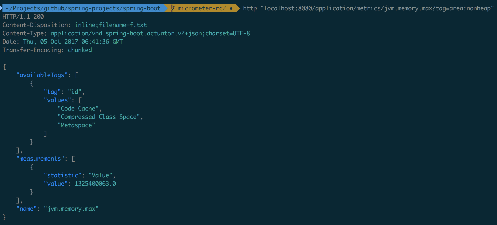

Spring Boot provides a metrics actuator endpoint that can be used diagnostically to examine the metrics collected by an app. The endpoint is disabled by default, in line with Spring Boot 2's litmus test that any endpoint that potentially exposes sensitive data about an application should be disabled by default. It can be enabled by setting:

[source,yml]
----
management.endpoints.web.expose: metrics
----

Navigating to `/actuator/metrics` displays a list of available meter names.

Provide a name as a selector to view information about that meter, e.g. `/actuator/metrics/jvm.memory.max`. The name you use here should match the name used in the code (which should be dot-separated), not the name after it has been naming-convention normalized for a monitoring system it is shipped to. In other words, if `jvm.memory.max` appears as `jvm_memory_max` in Prometheus because of its snake case naming convention, you should still use `jvm.memory.max` as the selector when inspecting the meter in Actuator.

Add any number of `tag=KEY:VALUE` query parameters to the end of the URL to dimensionally drill down on a meter.

The reported measurements are the _sum_ of the statistics of all meters matching the meter name and any tags that have been applied. So in the example below, the "Value" statistic is the sum of the maximum memory footprints of "Code Cache", "Compressed Class Space", and "Metaspace" areas of the heap. If you just wanted to see the maximum size for the "Metaspace", you could add an additional `tag=id:Metaspace` to the end of the URL.

.Example response from the metrics Actuator endpoint
