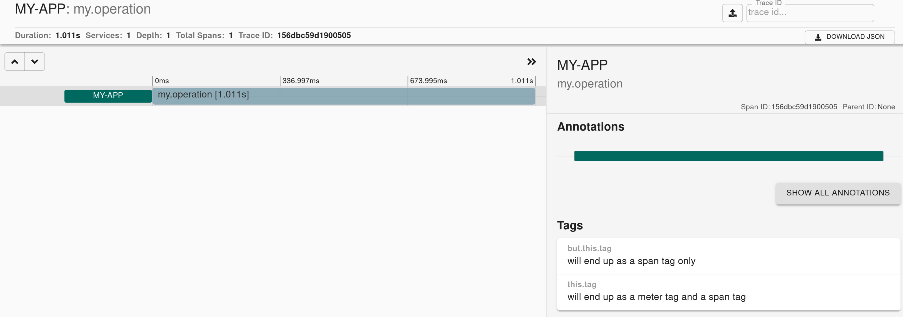

== Handler Configuration

// TODO: We need to separately document that Micrometer provides a TimerObservationHandler

For Micrometer Tracing to work with Micrometer Observation, you need to add a tracing related `ObservationHandler`.
Check the example below for an example of adding and using a single, `DefaultTracingObservationHandler`.

[source,java,subs=+attributes]
-----
include::../../../samples/src/test/java/io/micrometer/docs/tracing/TracingConfiguringTests.java[tags=handler_configuration,indent=0]
-----

You can also use a shorter version to perform measurements via the `observe` method.

[source,java,subs=+attributes]
-----
include::../../../samples/src/test/java/io/micrometer/docs/tracing/TracingConfiguringTests.java[tags=handler_configuration_observe,indent=0]
-----

This will result in the following Micrometer Metrics:

```
Gathered the following metrics
    Meter with name <my.operation> and type <TIMER> has the following measurements
        <[
            Measurement{statistic='COUNT', value=1.0},
            Measurement{statistic='TOTAL_TIME', value=1.011949454},
            Measurement{statistic='MAX', value=1.011949454}
        ]>
        and has the following tags <[tag(this.tag=will end up as a meter tag and a span tag)]>
```

And the following trace view in e.g. Zipkin



=== Ordered Handler Configuration

Micrometer Tracing comes with multiple `ObservationHandler` implementations.
To introduce ordering, you can use the `ObservationHandler.AllMatchingCompositeObservationHandler` to run logic for all `ObservationHandler` that are matching the given predicate and `ObservationHandler.FirstMatchingCompositeObservationHandler` to run logic only for the first `ObservationHandler` that matches the predicate.
The former can group or handlers and the latter can be chosen to e.g. run only one matching `TracingObservationHandler`.
